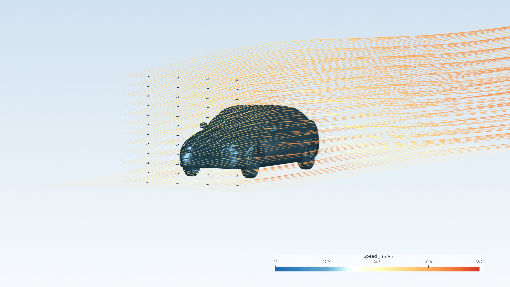
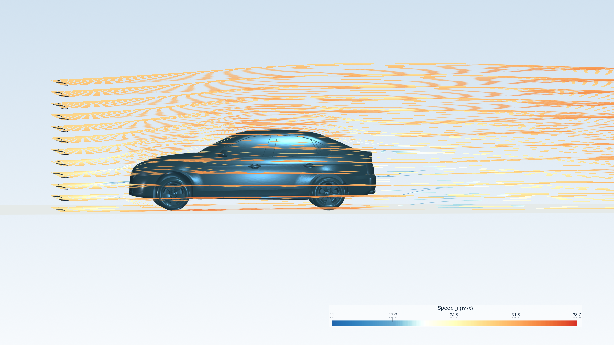
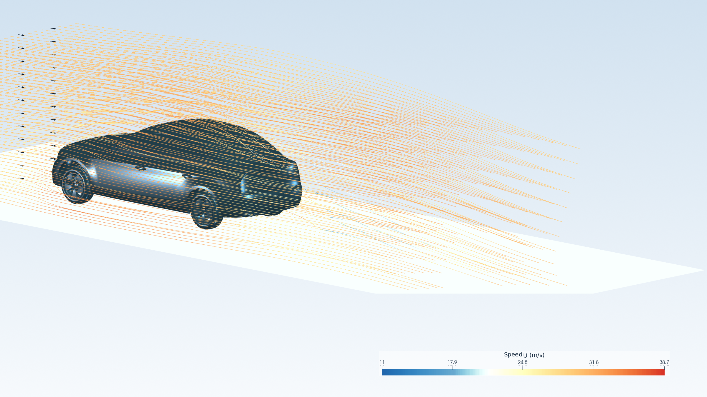

# AeroForge-Agent

**一句话 → CFD 仿真 → 风洞级可视化。**

> 接手 / 审查者请先读 [`HANDOVER.md`](HANDOVER.md)：已做工作、当前真实状态、
> 已知坑、未达标项与复核指南都在那里。

你说一句自然语言，AeroForge 完成剩下的全部流程：参数化几何或真实 STL → 从零生成
OpenFOAM 算例 → 网格（blockMesh + snappyHexMesh + checkMesh 质量门禁）→
稳态/瞬态 RANS 求解（simpleFoam/pimpleFoam, k-ω SST；残差、连续性、日志结束标记和新 forceCoeffs 门禁）→ 气动力（Cd 压差/摩擦分解）→
**真实场的风洞烟线高清渲染**。检测到 OpenFOAM 运行时（本机或 WSL）即执行
真实求解；检测不到则显式降级为 dry-run——**绝不把 dry-run 伪装成收敛的
CFD，也绝不用合成场伪造可视化**。

```bash
aeroforge "做一辆 宝马X3 的迎风仿真，风速 120 km/h，风向角 0 度" \
          --upload-stl x3.stl \
          --model-manifest x3.manifest.json \
          --upload-ground-clearance 0.005 \
          --vehicle-color "#1A80E6" \
          --animation
```

## 效果（真实求解场离屏渲染，非示意图）

| 3/4 前侧 | 正侧（中线烟幕） | 后上尾流 |
|---|---|---|
|  |  |  |


[下载 GIF](docs/media/drivaerml_steady_particles.gif) ·
[下载 MP4](docs/media/drivaerml_steady_particles.mp4) ·
[打开可拖动三维视图](docs/media/drivaerml_steady_particles.html)。这是冻结稳态 `U(x)` 场中的
无质量示踪粒子输运，不是湍流随物理时间演化的烟雾模拟；相机环绕版本仍保留在
[`drivaerml_steady_orbit.gif`](docs/media/drivaerml_steady_orbit.gif)。瞬态模式只使用
`pimpleFoam` 写出的多个真实时间步，并会在画面和清单中明确标注。

经典风洞烟线构图：种子位置按几何包围盒自动推导，速度着色统一采用蓝—青—黄—红
（`#2166ac → #67a9cf → #ffffbf → #fdae61 → #d73027`）色表；色标上下限按当前有效流线样本动态确定并保留
约 8% 头部空间，当实测速度跨度较大时自动切换为带物理刻度的 `log10` 色标，车漆可用
`--vehicle-color #RRGGBB` 指定；诊断模式支持有限透明近场采样面，默认英雄图
隐藏粗网格色块以保持主体清晰，避免旧版全域不透明色片遮挡车身；2400×1350 离屏渲染。
所有 StreamTracer 均显式绑定 OpenFOAM 的 `U` 速度向量，避免 STL 表面法向
被误当成流线积分方向。
流线从与 `internalMesh` 相交的有限近车身 YZ 播种面（15×11）释放，覆盖可见车身
截面而不是只画三条线；方向箭头显式由 `U` 定向、长度固定，颜色和色标只表示
速度模长 `|U|`，不使用球形节点，也不把箭头密度当作烟雾浓度。HTML 视图提供
`|U| (m/s)` 色标、播放/时间滑块、前视/尾流/俯视/后视镜/车尾细节预设，并支持鼠标轨道旋转和滚轮缩放；
交互场景使用车体尺寸驱动的手动纵横比，避免长尾流把车辆压扁；
动画默认 120 帧、40 fps（约 3 s），帧间输运时间仍按真实 `IntegrationTime` 插值。
收敛求解完成后自动生成并嵌入 Markdown 报告；
无收敛场或未安装 ParaView 时如实跳过并在报告说明原因。

真实车辆 STL 的来源、许可证、哈希、预处理和可复核命令见
[`docs/REAL_VEHICLE_MODEL.md`](docs/REAL_VEHICLE_MODEL.md)。仓库内置的
“简化车”只用于离线/快速冒烟，不应作为真实车型结果。大众、奥迪、宝马、
小鹏、理想、问界等具体车型的候选来源、许可边界和资产清单门禁见
[`docs/VEHICLE_ASSET_POLICY.md`](docs/VEHICLE_ASSET_POLICY.md)；品牌车型缺少
经授权文件或清单时流程会停止，不会退化成方块车。

[English](#english) · [中文](#中文)

---

<a id="english"></a>
## English

### What it does

Six deterministic stages, one sentence in, wind-tunnel pictures out:

```
RequirementParser → GeometryHunter → PhysicsConfig → MeshSmith → SimulationPilot → ResultAnalyst
   speed / yaw /      parametric      full case from   blockMesh +      simpleFoam        pvpython HD
   object from NL     STL or upload   scratch           snappy + gates   k-omega SST       smoke-line renders
```

- **RuntimeBridge** routes every OpenFOAM call to an available backend:
  native install, or **WSL on Windows** (auto-detected), with explicit
  dry-run when nothing is found.
- **Wind angle (yaw)** rotates the inlet vector, moving ground and drag
  direction together (`风向角 30°` just works).
- Force coefficients come with a **pressure/viscous breakdown** parsed
  from the solver log (the `.dat` `Cd(f)/Cd(r)` columns are NOT that
  split — we document the trap).
- Mesh quality is gated by `checkMesh`; failed mesh → no solver run.
- Visualization renders the **actual converged field** via pvpython
  (ParaView). No fake synthetic plots — those were removed in v0.4.0.

### Quick start

```bash
pip install -e '.[dev]'
pytest -q                                    # offline unit tests (no OpenFOAM needed)

python examples/demo_bmw_x3.py x3.stl x3.manifest.json  # licensed model + manifest
python examples/run_drivaerml.py body.stl    # public DrivAerML smoke run
python examples/run_drivaerml.py body.stl --profile showcase --iterations 260  # wake-render demo
python examples/paraview/streamline_hd.py <case_dir>   # re-render any solved case
python examples/verify_ahmed.py              # end-to-end validation vs experiment
aeroforge "vehicle CFD 30 m/s" --upload-stl body.stl --model-manifest model.json --animation
```

OpenFOAM: Linux → PATH; Windows → install inside WSL (RuntimeBridge
discovers it). ParaView (for visualization) is optional; without it the
pipeline still runs and the report says exactly why renders are missing.

### Design boundary (honesty statement)

This is a reproducible **RANS engineering workflow**, validated against
the classical Ahmed body (see below). It does not claim industrial CFD
accuracy: turbulence model choice, near-wall resolution and geometry
simplifications all matter. The built-in car is a simplified smoke-test geometry.
Named production vehicles require a licensed, watertight STL plus an asset manifest
and never fall back to it. Dry-run and real-solver
outputs are never mixed or relabelled.

### Credibility: Ahmed body validation

Classical benchmark (Ahmed et al. 1984, SAE 840300; Re≈2.78e6). Twelve
traceable experiment rounds (full story in
[`docs/VALIDATION.md`](docs/VALIDATION.md)) took Cd from a naive 1.056
to **0.449** at the 20° attached-flow angle (experiment 0.197), with the
v0.3.0 root-cause revision: pressure drag dominates (96%), and the
leading residual error is unresolved nose curvature — *not* friction or
model form as first attributed. Reaching ±10% requires level-6 nose
refinement (~8M cells) or transient + time averaging; both are on the
roadmap. Every number above is a real solver output.

---

<a id="中文"></a>
## 中文

### 架构

六个阶段由 `OrchestratorAgent` 顺序编排（确定性、可离线测试）：
需求解析（自然语言 → 速度/风向角/工况/对象名，车型关键词词典 + 引号 +
裸文本三级提取）、几何获取（参数化 Ahmed/简化车/圆柱/NACA 或上传 STL）、
物理配置（从零生成完整 OpenFOAM 算例；风向角旋转入口矢量/移动地面/阻力
方向）、网格（blockMesh → surfaceFeatureExtract → snappyHexMesh →
checkMesh 质量门禁）、求解（simpleFoam/pimpleFoam k-ω SST；残差、连续性、日志结束标记、力系数门禁及压差/摩擦
分解）、分析与可视化（pvpython 三机位烟线图嵌入 Markdown 报告）。

核心契约用 Pydantic v2 定义；编排为直接协程调用（v0.2.0 的
message_bus/state_machine 从未被使用，v0.4.0 已删除）。

### 快速开始

```bash
pip install -e '.[dev]'
pytest -q                                    # 离线单元测试（无需 OpenFOAM）

python examples/demo_bmw_x3.py x3.stl x3.manifest.json  # 授权模型 + 资产清单
python examples/run_drivaerml.py body.stl    # 公开 DrivAerML 真实几何冒烟
python examples/run_drivaerml.py body.stl --profile showcase --iterations 260  # 尾流展示图
python examples/paraview/streamline_hd.py <case_dir>   # 对已求解算例重新渲染
python examples/verify_ahmed.py              # 端到端基准验证
aeroforge "车辆外流场 30 m/s" --upload-stl body.stl --model-manifest model.json --animation
```

OpenFOAM 接入：Linux 装到 PATH；Windows 在 WSL 中安装（自动探测）。
ParaView 可选（可视化用）；缺失时流程照常跑完，报告如实说明渲染跳过原因。

### 关键设计

- **RuntimeBridge 三态运行时**：native / WSL / 不可用，显式 dry-run。
- **风向角一句话支持**：`风向角 30°` 同时旋转入口、移动地面与阻力方向，
  升力方向不变；侧向域 2.5W，大偏航角时建议自行扩大侧向边界。
- **可视化只画真实场**：pvpython 自动发现（PATH/常见目录）→ 模板脚本
  离屏渲染 → 产物校验；CellData 先转 PointData，使用 Tube 烟线管；
  车辆采用可配置统一车漆，蓝—青—黄—红色标同时突出低速与高速区域；速度跨度较大时使用
  物理刻度 `log10` 色标；有限透明近场采样面
  仅在诊断模式显示，默认展示图隐藏粗网格色块；流线显式使用真实 `U` 向量。
- **具体车型资产门禁**：品牌车型必须提供本地 STL、来源/许可证/SHA-256 清单；
  缺项或哈希不符即停止，不再静默换成简化车。仓库不重新分发来源不明或受限模型。
- **诚实动画**：稳态默认用真实 `U(x)` 与 `IntegrationTime` 驱动无质量示踪粒子，
  或用 `--animation-mode steady_orbit` 做相机环绕；二者均不冒充瞬态尾流。
  瞬态动画只读取 `pimpleFoam` 的真实物理时间步，少于 3 个时跳过、不改标稳态。
  GIF 与可用时的 MP4 配有清单，区分求解迭代/源场时间、粒子输运秒和实际播放秒，
  并记录场/几何/模板/产物哈希；更换展示几何不能沿用其他车型风场。
- **力系数压差/摩擦分解**来自求解日志（v2412 dat 的 Cd(f)/Cd(r) 列并非
  摩擦/压差，勿误读——本项目 v0.2.0 曾因此误判）。
- **低 Re 壁面预设**（默认）+ 前缘/尾流加密盒；经典壁面函数保留为
  `wall_treatment="wallFunction"` 快速回退。
- **基准验证**：Ahmed body 20° 定量判据角 / 25° 如实报告角，十二轮可追溯
  实验与 v0.3.0 归因修订见 [`docs/VALIDATION.md`](docs/VALIDATION.md)。

### 设计边界（诚实声明）

本项目是**可复现的 RANS 工程流程**，不宣称工业 CFD 精度。内置参数化"车"仅是
快速冒烟几何（真实车型请上传经许可的 STL）；Ahmed 历史验证报告记录 Cd=0.449 vs 实验
0.197，但审查发现工作区存在更晚的 forceCoeffs 文件（当前尾段约 0.486），
详见 [`docs/AUDIT_2026-08-30.md`](docs/AUDIT_2026-08-30.md)。dry-run 与真实
求解输出严格分离，可视化不用合成场伪造。

## License

MIT
